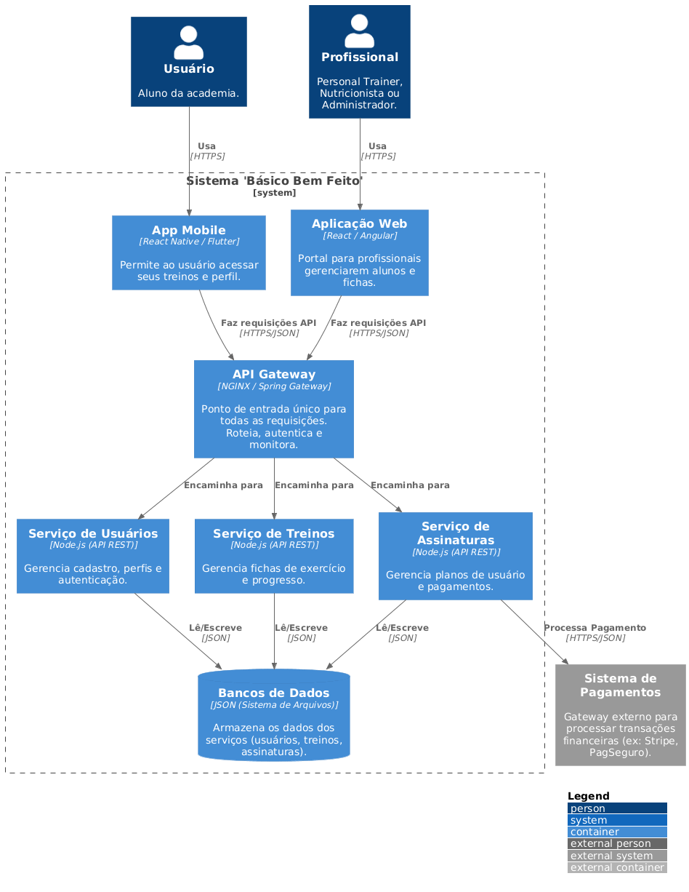
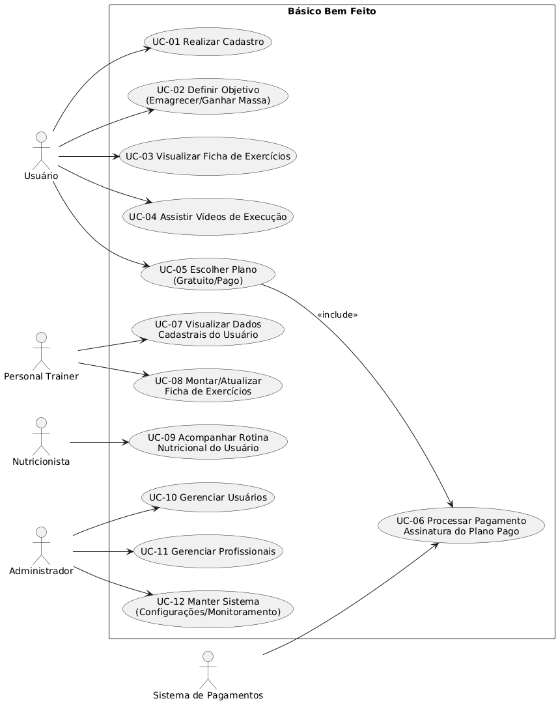
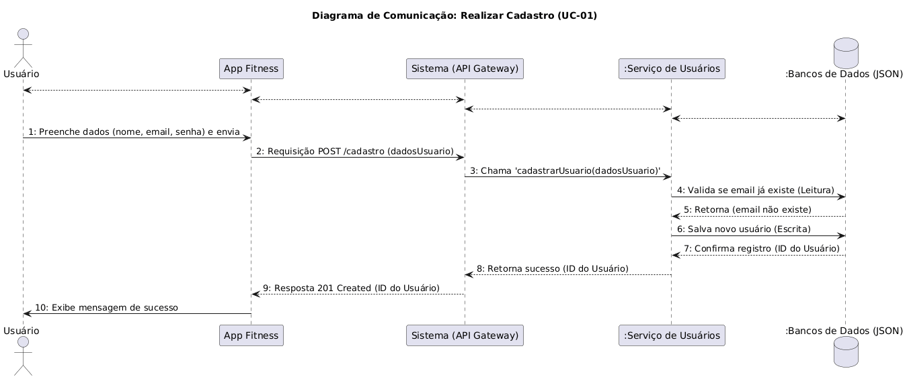
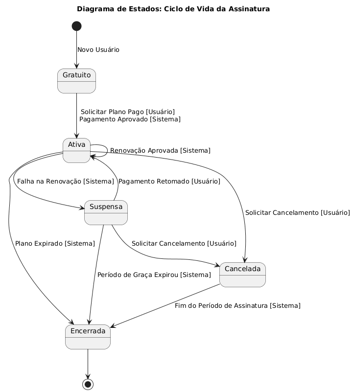
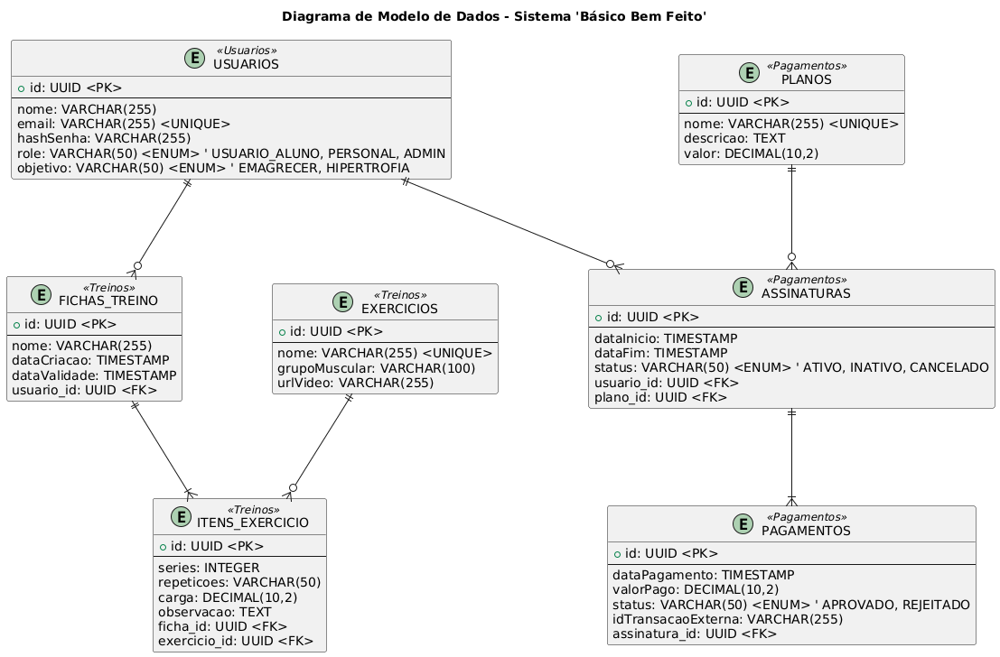
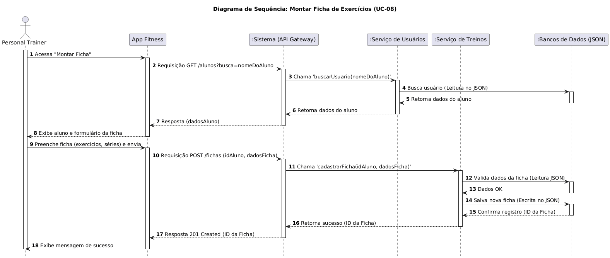
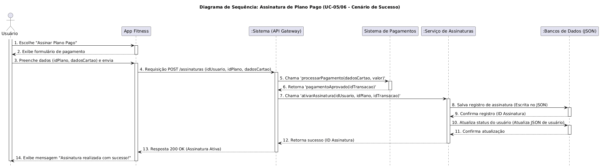
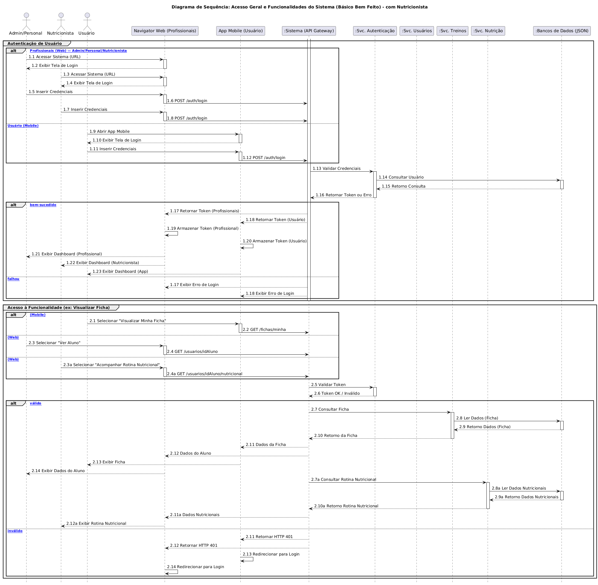

# 🏋️ Básico Bem Feito 

## Documentação de Arquitetura de Software

---

### 🚀 Bem-vindo(a) à documentação do Projeto Básico Bem Feito!

Este repositório serve como um hub central para toda a documentação de arquitetura, design e modelagem do software **Básico Bem Feito**. Aqui, você encontrará uma coleção abrangente de diagramas UML e outros artefatos visuais que detalham a estrutura, o comportamento e as interações do sistema, fornecendo uma visão clara e estruturada para todos os stakeholders envolvidos.

### 📚 Índice

* [Visão Geral da Documentação](#-visão-geral-da-documenta%C3%A7%C3%A3o)
* [Diagrama de Arquitetura](#-diagrama-de-arquitetura)
* [Diagrama de Caso de Uso](#-diagrama-de-caso-de-uso)
* [Diagrama de Classe](#-diagrama-de-classe)
* [Diagrama de Componentes](#-diagrama-de-componentes)
* [Diagramas de Comunicação](#-diagramas-de-comunicação)
    * [Comunicação: Realizar Cadastro (UC-01)](#diagrama-de-comunicação-realizar-cadastro-uc-01)
    * [Comunicação: Montar Ficha de Exercícios (UC-08)](#diagrama-de-comunicação-montar-ficha-de-exercícios-uc-08)
    * [Comunicação: Assinatura de Plano Pago (UC-05/06)](#diagrama-de-comunicação-assinatura-de-plano-pago-uc-0506)
* [Diagrama de Estados](#-diagrama-de-estados)
* [Diagrama de Implantação](#-diagrama-de-implanta%C3%A7%C3%A3o)
* [Diagrama de Modelo de Dados](#-diagrama-de-modelo-de-dados)
* [Diagramas de Sequência](#-diagramas-de-sequência)
    * [Sequência: Realizar Cadastro (UC-01)](#diagrama-de-sequência-realizar-cadastro-uc-01)
    * [Sequência: Montar Ficha de Exercícios (UC-08)](#diagrama-de-sequência-montar-ficha-de-exerc%C3%ADcios-uc-08)
    * [Sequência: Assinatura de Plano Pago (UC-05/06)](#diagrama-de-sequência-assinatura-de-plano-pago-uc-0506)
    * [Sequência: Sistema Geral](#diagrama-de-sequência-sistema-geral)
* [Outros Artefatos](#-outros-artefatos)

---

### 💡 Visão Geral da Documentação

Cada seção abaixo contém um diagrama específico acompanhado de uma breve descrição do seu propósito e do que ele representa no contexto do sistema **Básico Bem Feito**.

---

### 🏛️ Diagrama de Arquitetura

Este diagrama (C4 Nível 2) ilustra a estrutura de alto nível do sistema **Básico Bem Feito**, mostrando os principais contêineres (aplicações, microsserviços, bancos de dados) e suas interações fundamentais. Ele fornece uma visão macro da organização do software.

---

###  actors Diagrama de Caso de Uso

Apresenta os casos de uso principais do sistema **Básico Bem Feito**, identificando os atores (Usuário, Personal Trainer, Nutricionista, Admin) e as funcionalidades que eles podem executar, descrevendo o comportamento externo do sistema.

---

### 🧱 Diagrama de Classe

Detalha as classes do sistema (agrupadas por domínios como "Gestão de Usuários" e "Gestão de Treinos"), seus atributos, métodos e os relacionamentos estáticos (associações) entre elas, representando a estrutura estática do projeto.

---

### 🧩 Diagrama de Componentes

Exibe a organização e a dependência dos componentes de software (como `API Gateway`, `Svc. Usuários`, `Svc. Treinos`), fornecendo uma visão modular do sistema e como as diferentes partes lógicas se encaixam e interagem.

---

### 💬 Diagramas de Comunicação

Estes diagramas mostram a interação entre objetos e componentes em um determinado cenário, focando na troca de mensagens numeradas e na colaboração para atingir um objetivo específico.

#### Diagrama de Comunicação: Realizar Cadastro (UC-01)

Detalha as interações necessárias para o processo de cadastro de um novo usuário no sistema.

#### Diagrama de Comunicação: Montar Ficha de Exercícios (UC-08)

Detalha as interações dos componentes do sistema para que um Personal Trainer monte uma nova ficha de treino para um aluno.

.png)

#### Diagrama de Comunicação: Assinatura de Plano Pago (UC-05/06)

Ilustra o fluxo de mensagens entre os objetos para registrar uma nova assinatura paga, incluindo a comunicação com o gateway de pagamento.

.png)

---

### 🔄 Diagrama de Estados

Representa os diferentes estados que o objeto **Assinatura** pode ter ao longo do tempo (ex: `Gratuito`, `Ativa`, `Suspensa`, `Cancelada`) e as transições entre esses estados em resposta a eventos específicos.

---

### 🚀 Diagrama de Implantação

Descreve a configuração física de hardware em nuvem onde o software será executado, incluindo os nós (Servidor da Aplicação, Servidor de Arquivos) e os componentes de software (`Microsserviços`, `Arquivos .json`) implantados neles.

---

### 💾 Diagrama de Modelo de Dados

Ilustra a estrutura lógica do banco de dados (ERD), mostrando as entidades (tabelas como `USUARIOS`, `FICHAS_TREINO`), seus atributos (colunas) e os relacionamentos (`<PK>`, `<FK>`) entre elas.

---

### ⏳ Diagramas de Sequência

Estes diagramas detalham a ordem cronológica das interações e a troca de mensagens entre objetos ou atores para realizar uma funcionalidade específica, mostrando a vida útil de cada participante.

#### Diagrama de Sequência: Realizar Cadastro (UC-01)

Representa o fluxo de eventos e mensagens para o cadastro de um novo usuário.

#### Diagrama de Sequência: Montar Ficha de Exercícios (UC-08)

Mostra a sequência de interações para o processo de criação de uma ficha de treino por um Personal Trainer.

#### Diagrama de Sequência: Assinatura de Plano Pago (UC-05/06)

Ilustra o fluxo de eventos e mensagens para a assinatura de um plano pago, desde a ação do usuário até a confirmação do pagamento.

#### Diagrama de Sequência: Sistema Geral

Oferece uma visão mais ampla das principais interações do sistema, focando nos fluxos de **Autenticação** e **Acesso a Funcionalidades** de forma genérica.

---

### 📝 Outros Artefatos

* **Contratos de Operação:** Descrevem as pré-condições e pós-condições para as operações de sistema (ex: `cadastrarUsuario`, `cadastrarFicha`).
* **Histórico de Revisões:** Documenta o versionamento e as alterações realizadas ao longo do desenvolvimento da arquitetura.
